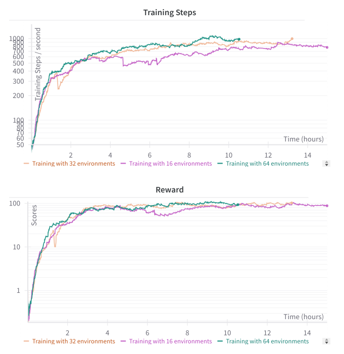
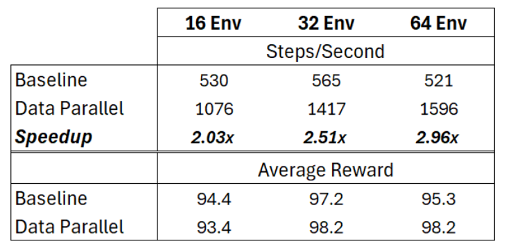

# PAAC-PyTorch
Obs: UNDER CONSTRUCTION

This is a PyTorch implementation of a simple Advantage Actor Critic model for Atari games, combining different parallelization strategies:
- Multithreaded Environment Interaction
- Multi-GPU Neural Network Training 
- Distributed Population-Based Training [TBR]

      

# Usage
- To train the agent, run:

```
python main.py --env-name BreakoutDeterministic-v4
```

- You can play the game by:
```
python play.py --env-name BreakoutDeterministic-v4
```

# Results - Breakout-v4 Atari
## Multithreaded Parallelism

Below plots shows the training steps/s and accumulated rewards varying the number of threads = number of parallel environments. 



## + Multi-GPU parallelism

Table below shows the rewards and speedup by utilizing Distributed Data Parallel (2 GPUs) on top of multithreaded parallelism.



## + Distributed PPO
TODO

# Acknowledgements
Code is heavily based on ["Efficient Parallel Methods for Deep Reinforcement Learning"](https://arxiv.org/abs/1705.04862)

# References
[1] Clemente AV, Castejón HN, Chandra A. Efficient parallel methods for deep reinforcement learning. arXiv preprint arXiv:1705.04862. 2017 May 13.

[2] Jaderberg, Max, Valentin Dalibard, Simon Osindero, Wojciech M. Czarnecki, Jeff Donahue, Ali Razavi, Oriol Vinyals et al. "Population based training of neural networks." arXiv preprint arXiv:1711.09846 (2017).
