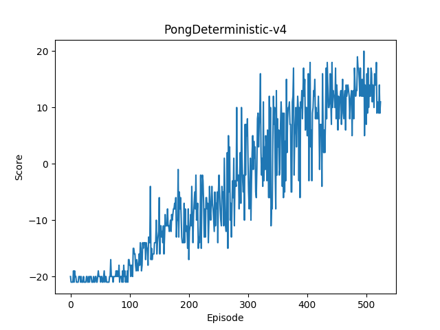

# PAAC-PyTorch

This is a PyTorch implementation of a simple Advantage Actor Critic model for Atari games, combining different parallelization strategies:
- Multithreaded Environment Interaction
- Multi-GPU Neural Network Training 
- Distributed Population-Based Training [TBR]

      

# Usage
- You can train the agent by:

```
python main.py --env-name BreakoutDeterministic-v4 --num-workers 4
```

- You can play the game by:
```
python play.py --env-name BreakoutDeterministic-v4
```

# Results
<p float="first 4 envs">
  
  
  
  
</p>

# TODO
- Add PPO code

# Acknowledgements
Codebase is heavily based on ["Efficient Parallel Methods for Deep Reinforcement Learning"](https://arxiv.org/abs/1705.04862)

# References
[1] Clemente AV, Castejón HN, Chandra A. Efficient parallel methods for deep reinforcement learning. arXiv preprint arXiv:1705.04862. 2017 May 13.
[2] Jaderberg, Max, Valentin Dalibard, Simon Osindero, Wojciech M. Czarnecki, Jeff Donahue, Ali Razavi, Oriol Vinyals et al. "Population based training of neural networks." arXiv preprint arXiv:1711.09846 (2017).
